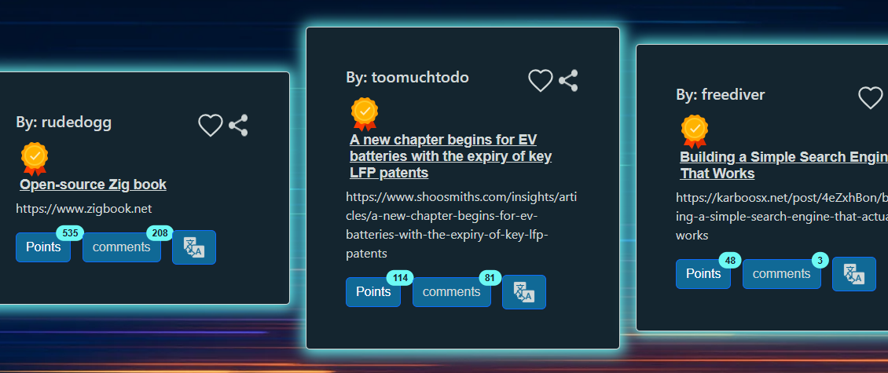
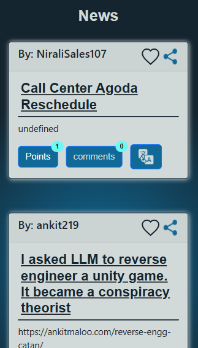
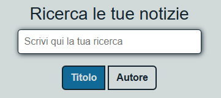

# tongue-technews
Featured on Hacker News, one of the most influential tech communities worldwide

<h1 align="left">Hi 👋! My name is Davide from &#x1f1ee;&#x1f1f9;🍕&#127837;🛵</h1>
<h2>Here you can try a different way of reading tech news, taking advantage of one of the largest tech communities in the world, Haker News, with a few small additional features&#128064;.</h2>

I created a platform for getting tech news, divided into three different sections:

 

1. Top-News 
Here you can find the top 10 most 
voted news on hacker news, scrollable horizontally

 
 
 

2. The last 10 uploaded news items are collected here, with the possibility of uploading further news items by pressing the appropriate button

 

3. This search bar allows you to search
 for news by title or author. Ten news items will be loaded,  and you can increase them using the appropriate button.

<h2>A few more small features</h2>

-Instant translation of the title for my Italian friends      &#x1f1ee;&#x1f1f9;-&#x1f1ec;&#x1f1e7;

-Share the news on your favorite social networks 

-Save your news in the "favorites" section  
<b>Note: Saving currently uses your device's local storage. A login page to permanently save your bookmarks will be implemented soon.</b>

-An AI chatbot, accessible via the button at the bottom right, will be able to clarify any questions you may have without leaving the page!

 
 
 

###

<h2>THANK YOU!</h2>

Try it: <a href="https://demasidavide.github.io/progetti/tongue/src">HERE</a>

## Future Improvements
- [ ] Login
- [ ] Database
- [ ] Downloadable page for mobile

###
###
<h3>Some of the languages ​​I use the most:</h3>

   

###

  
  
  
  
  
  
  
  
  
  
  
  
  
  
  
  
  

###

  
  
  

###